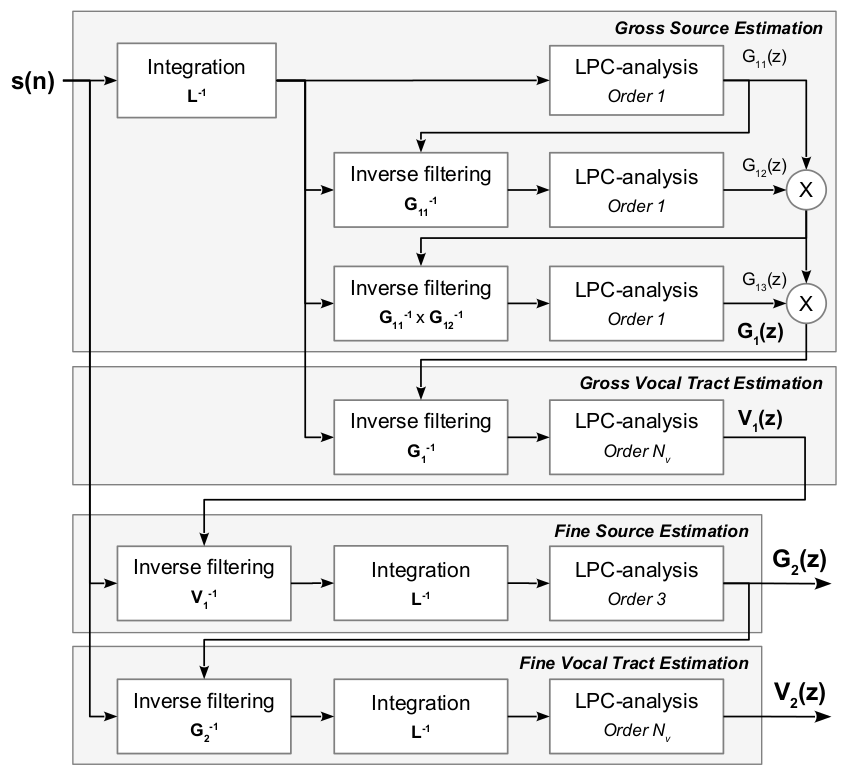

# Vocal Analyzer

Every person's voice is unique because of the unique shapes of their vocal structures. The goal of this program is to develop a speech analyzer system that models a recorded voice as a combination of filters that each represent the different shapes of a person's vocal tract as they speak.

Using this model will allow us to theoretically tweak a person's voice in some of the following ways:

- change pitch
- change gender
- change mannerisms/pauses/inflextion

By changing these, we can theoretically mask someone's voice so well that it is very difficult/impossible to determine who the original speaker was.

# Theory

This project is based on the following research paper:
[On the Use of a Spectral Glottal Model for the Source-filter Separation of Speech](https://arxiv.org/pdf/1712.08034.pdf)

The approach will follow the general form proposed in the paper, shown in the flowchart below.

# Resources

## Examples

- A nice [wave coherence example](https://matplotlib.org/3.1.1/gallery/lines_bars_and_markers/cohere.html). Might be relevant at some point.
- A number of [signal processing examples](https://docs.scipy.org/doc/scipy/reference/tutorial/signal.html)
- [Signal processing examples](https://www.pythonforengineers.com/audio-and-digital-signal-processingdsp-in-python/)
- [Audio signal filtering with pyaudio](https://bastibe.de/2012-11-02-real-time-signal-processing-in-python.html)